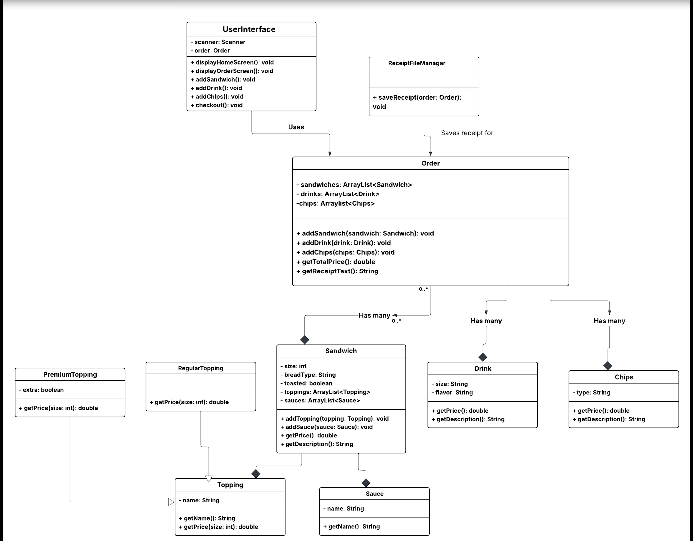

# Deli-cious

## Project Description

Deli-cious is a Java console application for a custom sandwich shop. The program allows a customer to create an order by adding sandwiches, drinks, and chips. After the customer finishes the order, the app calculates the total price and saves a receipt.

This project was created for Capstone 2 to practice object-oriented programming, class design, user input, ArrayLists, and file handling in Java.

## Features

- Display a home screen menu
- Start a new order
- Add custom sandwiches
- Choose sandwich size, bread type, toppings, sauces, and toasted option
- Add drinks
- Add chips
- View the order total
- Checkout and save a receipt
- Cancel an order

## Class Diagram

The diagram below shows the main classes in the project and how they connect to each other.



## Project Structure

```text
deli-cious/
│
├── src/
│   └── main/
│       └── java/
│           └── com/pluralsight/
│               ├── Main.java
│               ├── ui/
│               │   └── UserInterface.java
│               ├── models/
│               │   ├── Order.java
│               │   ├── Sandwich.java
│               │   ├── Drink.java
│               │   ├── Chips.java
│               │   ├── Topping.java
│               │   ├── RegularTopping.java
│               │   ├── PremiumTopping.java
│               │   └── Sauce.java
│               └── filemanager/
│                   └── ReceiptFileManager.java
│
├── images/
│   └── Deli-cious.png
│
├── pom.xml
└── README.md